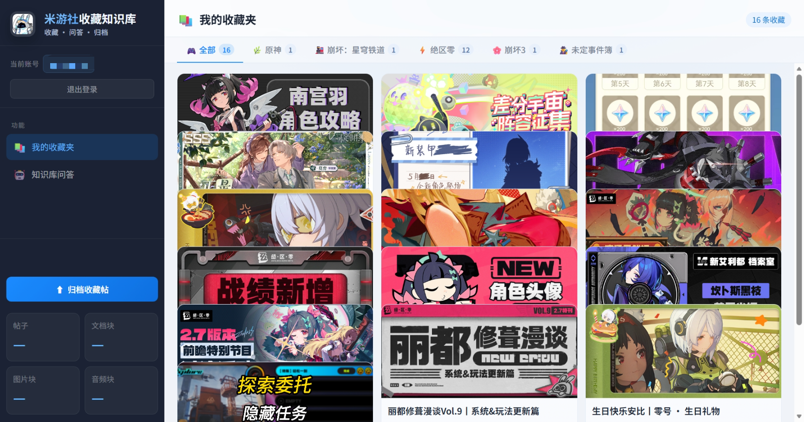

# 米游社收藏夹 AI 知识库（mys_RAGAgent）

一个基于 **FastAPI + ChromaDB + DashScope(Qwen)** 的米游社收藏夹知识库应用：

- 扫码登录米游社账号
- 拉取收藏夹帖子
- 增量归档到本地向量库
- 基于归档内容进行知识库问答
- 支持按游戏分区选择入库（当前分区 / 全部分区）

---

## 功能概览

- **扫码登录**：通过米游社二维码登录并提取 `stuid/stoken/mid`
- **收藏夹浏览**：按游戏分区查看收藏帖子
- **增量入库**：归档收藏帖到 RAG 知识库，自动去重
- **异步入库进度**：启动任务后可实时轮询 `current/total` 进度
- **入库范围选择**：点击归档前弹窗选择
  - 当前分区
  - 全部分区
- **分区入库状态提示**：在游戏分区标签显示 `入库中...` / `已入库`
- **RAG 问答**：基于归档内容回答问题并返回参考来源
- **寒暄优化**：如“你好”这类寒暄不会附带参考来源
- **模型可配置**：Image/Audio/Embedding/QueryParser/Answer 均可在 `.env` 自定义

### 界面预览

**扫码登录**

[](docs/images/login-qrcode.png)

**收藏夹看板**

[](docs/images/favourite-dashboard.png)


---

## 项目结构

```text
MYS_RagAgent/
├─ main.py                 # 启动入口（仅创建 app）
├─ requirements.txt        # Python 依赖
├─ server/                 # 后端应用层
│  ├─ app.py               # FastAPI app factory
│  ├─ models.py            # 请求模型
│  ├─ routers/             # 按领域拆分路由
│  │  ├─ common.py
│  │  ├─ login.py
│  │  ├─ mys_api.py
│  │  └─ rag.py
│  └─ services/            # 外部 API/任务状态服务
│     ├─ ingest_state.py
│     └─ mys_api.py
├─ static/                 # 前端页面与样式脚本
│  ├─ index.html
│  ├─ style.css
│  ├─ app.js
│  └─ marked.min.js
├─ rag/                    # RAG 核心模块
│  ├─ agents.py            # 归档流程
│  ├─ chroma.py            # ChromaDB 读写
│  ├─ retrieval.py         # 检索与回答生成
│  └─ db.py
└─ data/chroma/            # 本地向量库数据目录
```

---

## 环境要求

- Python 3.10+
- Windows / macOS / Linux

---

## 快速开始

### 1) 克隆项目

```bash
git clone <your-repo-url>
cd MYS_RagAgent
```

### 2) 创建虚拟环境并安装依赖

```bash
python -m venv .venv
# Windows
.venv\Scripts\activate
# macOS/Linux
# source .venv/bin/activate

pip install -r requirements.txt
```

### 3) 配置环境变量

复制模板并填写：

```bash
# Windows PowerShell
copy .env.example .env
# macOS/Linux
# cp .env.example .env
```

核心参数（完整说明见 `.env.example`）：

```env
DASHSCOPE_API_KEY=你的阿里云百炼API_KEY
IMAGE_AGENT_MODEL=qwen-vl-max
AUDIO_AGENT_MODEL=paraformer-v2
EMBEDDING_MODEL=text-embedding-v4
QUERY_PARSER_MODEL=qwen-max
ANSWER_MODEL=qwen-max
IMAGE_AGENT_MAX_IMAGES_PER_POST=3
IMAGE_AGENT_INTERNAL_WORKERS=3
```

### 4) 启动服务

```bash
python main.py
```

启动后访问：

- 首页：`http://127.0.0.1:8000/`
- API 文档：`http://127.0.0.1:8000/docs`

---

## 主要 API

- `POST /api/login/qrcode/generate` 生成扫码二维码
- `POST /api/login/qrcode/status` 查询扫码状态
- `POST /api/roles/list` 获取角色列表
- `POST /api/favourite/get` 获取收藏夹
- `POST /api/rag/ingest/favourites/start` 启动归档任务
- `GET  /api/rag/ingest/favourites/progress` 查询归档任务进度
- `POST /api/rag/ingest/favourites` 兼容旧同步归档接口
- `GET  /api/rag/stats` 知识库统计
- `POST /api/rag/query` 知识库问答
- `DELETE /api/rag/reset` 清空知识库

---

## 常见问题

### 1. 输入“你好”为什么会出现参考来源？
已修复：寒暄类问题会直接返回问候，不附带来源。

### 2. ChromaDB 数据存在哪里？
默认在 `data/chroma/`。

### 3. API Key 未配置会怎样？
问答相关能力会不可用，请先配置 `DASHSCOPE_API_KEY`。

---

## License

仅用于学习与内部开发使用
