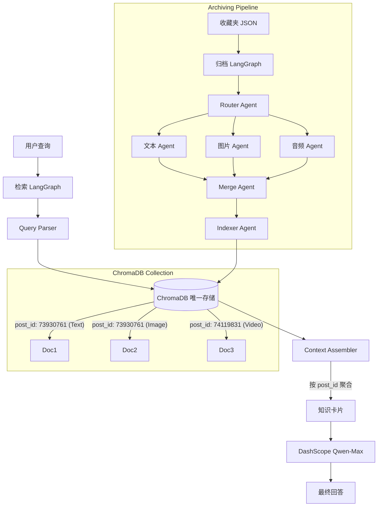

# 米游社收藏夹多模态 RAG 知识库 Agent 设计文档 (单 ChromaDB 版)

## 1. 项目概述

### 1.1 项目背景
基于米游社用户收藏夹 JSON 数据 (`userFavourite_data.json`)，构建一个支持文本、图片、视频多模态检索的 RAG 智能体。项目决定采用 **单 ChromaDB 架构**，移除 SQLite，利用 ChromaDB 的 Metadata Filtering 能力替代关系型数据库的结构化查询功能，以降低系统复杂度并提高开发效率。

### 1.2 核心目标
1.  **单库存储**：向量数据与结构化元数据统一存入 ChromaDB。
2.  **多模态关联**：通过 `post_id` 在应用层聚合同一帖子下的文本、图片、视频内容。
3.  **多 Agent 协作**：基于 LangGraph 构建文本、图片、音频三个专业处理 Agent。
4.  **技术栈**：LangGraph (编排) + DashScope (模型) + ChromaDB (存储)。

### 1.3 技术栈选型
| 模块           | 技术选型      | 说明                                                         |
| :------------- | :------------ | :----------------------------------------------------------- |
| **编排框架**   | **LangGraph** | 构建有状态的多 Agent 工作流 (归档/检索)                      |
| **LLM 模型**   | **DashScope** | 文本：`qwen-max` / 视觉：`qwen-vl-max` / 嵌入：`text-embedding-v3` |
| **向量数据库** | **ChromaDB**  | **唯一存储**，负责向量检索 + 元数据过滤                      |
| **数据处理**   | **Python**    | Pandas (JSON 解析), FFmpeg (音频提取), Requests (图片下载)   |

---

## 2. 系统架构设计

### 2.1 核心设计理念：Post-Centric (以帖子为中心)
由于移除了 SQLite，所有关联逻辑通过 **`post_id`** 在 ChromaDB 元数据中维护，并在 LangGraph 检索阶段进行内存聚合。

*   **存储层**：ChromaDB 中每个文档块 (Chunk) 都携带完整的帖子元数据 (`post_id`, `game_id`, `is_official` 等)。
*   **检索层**：ChromaDB 返回碎片化的 chunks -> LangGraph **Context Assembler** 按 `post_id` 分组 -> 组装成完整的“知识卡片” -> 送入 LLM。

### 2.2 架构图


---

## 3. 数据存储设计 (ChromaDB Only)

### 3.1 Collection 设计
*   **Collection Name**: `miyou_favorites`
*   **Embedding Model**: `text-embedding-v3` (1024 维)
*   **Distance Function**: `cosine`

### 3.2 文档结构 (Document + Metadata)
所有模态数据扁平化存储。每个分块都是一条独立记录，但通过 `metadata.post_id` 强关联。

```python
{
    # ─────────────────────────────────────────────────────
    # 1. 核心标识 (ID)
    # ─────────────────────────────────────────────────────
    "id": "doc_73930761_text_001",      # 格式：doc_{post_id}_{modality}_{index}
    
    # ─────────────────────────────────────────────────────
    # 2. 向量化内容 (Document)
    # ─────────────────────────────────────────────────────
    "document": "绳匠们好呀~《绝区零》2.7 版本「英雄不死于往昔」将于 2026 年 3 月 24 日正式上线...",
    # 说明：
    # - 文本模态：清洗后的正文分块
    # - 图片模态：VL 模型生成的图片描述 + OCR 文字
    # - 视频模态：ASR 转录文本
    
    # ─────────────────────────────────────────────────────
    # 3. 元数据 (Metadata) - 替代原 SQLite 功能
    # ─────────────────────────────────────────────────────
    "metadata": {
        # 【核心关联】
        "post_id": "73930761",              # 唯一锚点，用于聚合
        "modality": "text",                 # 枚举：text, image, video
        
        # 【业务过滤】(支持 Chroma where 查询)
        "game_id": 8,                       # int: 8=绝区零
        "forum_id": 58,                     # int: 58=官方
        "is_official": True,                # bool: 是否官方
        "author_uid": "152039149",          # string: 作者 ID
        "author_name": "米仔",              # string: 作者名
        
        # 【时效性】
        "created_at": 1773487811,           # int: 时间戳，支持范围查询
        "version_tag": "2.7",               # string: 游戏版本
        
        # 【质量排序】
        "like_num": 14365,                  # int: 点赞数
        "quality_score": 0.92,              # float: 综合评分，用于重排序
        
        # 【内容标签】(支持列表过滤)
        "entities": ["南宫羽", "希希芙"],    # List[string]: 实体
        "intent_tags": ["活动介绍", "奖励"],  # List[string]: 意图
        
        # 【溯源信息】
        "post_title": "《绝区零》2.7 版本前瞻讨论活动开启",
        "post_url": "https://m.miyoushe.com/zzz/#/post/73930761",
        
        # 【多模态辅助】
        "media_url": "https://...",         # 如果是图片/视频，存原链接
        "has_image": True,                  # 原帖是否含图
        "has_video": False                  # 原帖是否含视频
    }
}
```

### 3.3 基于 JSON 数据的映射示例
以 `post_id: 73930761` 为例：

| JSON 字段                      | Chroma Metadata 字段    | 示例值                 |
| :----------------------------- | :---------------------- | :--------------------- |
| `post.post_id`                 | `post_id`               | `"73930761"`           |
| `post.game_id`                 | `game_id`               | `8`                    |
| `forum.name`                   | `forum_name`            | `"官方"`               |
| `post.post_status.is_official` | `is_official`           | `True`                 |
| `stat.like_num`                | `like_num`              | `14365`                |
| `topics.name`                  | `entities`              | `["南宫羽", "希希芙"]` |
| `post.created_at`              | `created_at`            | `1773487811`           |
| `post.images`                  | `media_url` (Image Doc) | `"https://..."`        |
| `post.vod_list`                | `media_url` (Video Doc) | `"https://..."`        |

---

## 4. 归档 Pipeline (LangGraph Archiving Flow)

### 4.1 工作流状态定义 (ArchiveState)
```python
class ArchiveState(TypedDict):
    post_id: str
    raw_ dict              # 原始 JSON 帖子数据
    text_result: dict           # 文本 Agent 输出
    image_result: dict          # 图片 Agent 输出
    audio_result: dict          # 音频 Agent 输出
    unified_docs: List[dict]    # 合并后的文档列表 (准备入库)
    index_status: dict          # 入库状态
```

### 4.2 节点详细设计

#### 1. Router Agent (归档路由)
*   **输入**: `raw_data`
*   **逻辑**: 分析帖子包含的模态。
    *   若 `images` 非空 -> 触发 Image Agent。
    *   若 `vod_list` 非空 -> 触发 Audio Agent。
    *   若 `content` 非空 -> 触发 Text Agent。
*   **输出**: 更新任务计划。

#### 2. Text Agent (文本处理)
*   **工具**: LangChain `RecursiveCharacterTextSplitter`
*   **逻辑**:
    1.  清洗 `content` 中的 HTML 标签及 `[图片]` 占位符。
    2.  分块（Chunk Size 1024, Overlap 200）。
    3.  提取 `topics` 作为 `entities`。
    4.  生成 `intent_tags` (如 "活动介绍")。
*   **输出**: 文本块列表，携带 `post_id` 等元数据。

#### 3. Image Agent (图片处理)
*   **工具**: DashScope `qwen-vl-max`
*   **逻辑**:
    1.  遍历 `images` 列表。
    2.  调用 VL 模型生成描述（Prompt: "请详细描述这张游戏攻略图片的内容，包括角色名称、技能数值、界面文字等"）。
    3.  (可选) 调用 OCR 提取图片文字。
    4.  将 `描述 + OCR` 作为 `document` 内容。
*   **输出**: 图片描述列表，携带 `post_id` 及 `media_url`。

#### 4. Audio Agent (视频/音频处理)
*   **工具**: DashScope 语音识别模型
*   **逻辑**:
    1.  下载 `vod_list` 中的视频音频流。
    2.  生成带时间戳的转录文本。
    3.  按时间分块。
*   **输出**: 视频转录文本列表，携带 `post_id` 及 `media_url`。

#### 5. Merge Agent (核心合并)
*   **职责**: **解决多模态关联与质量评分**。
*   **逻辑**:
    1.  接收 Text/Image/Audio Agent 的输出。
    2.  确保所有文档块携带相同的 `post_id`。
    3.  计算 `quality_score`：
        ```python
        score = 0.5 * norm(like_num) + 0.3 * is_official + 0.2 * recency
        ```
    4.  构建 `unified_docs` 列表，准备入库。

#### 6. Indexer Agent (索引入库)
*   **逻辑**:
    1.  调用 DashScope `text-embedding-v3` 生成向量。
    2.  写入 ChromaDB (`collection.add`)。
    3.  **注意**: 确保 metadata 类型一致 (int/bool/string)，否则过滤会失效。

---

## 5. 检索与生成 Pipeline (LangGraph Retrieval Flow)

### 5.1 工作流状态定义 (RetrievalState)
```python
class RetrievalState(TypedDict):
    query: str
    parsed_intent: dict         # 意图、实体、过滤条件
    retrieved_chunks: List      # 原始检索结果 (碎片化)
    grouped_posts: List         # 按 post_id 聚合后的结果 (知识卡片)
    final_answer: str
```

### 5.2 节点详细设计

#### 1. Query Parser (查询解析)
*   **模型**: `qwen-max`
*   **逻辑**:
    1.  提取实体（如“安比”、"2.7 版本”）。
    2.  识别意图（如“活动奖励”、“攻略步骤”）。
    3.  生成 Chroma 过滤条件 `where_clause`。
*   **输出**: `parsed_intent` (包含 `game_id`, `is_official`, `entities` 等)。

#### 2. Chroma Retriever (向量检索)
*   **逻辑**: 使用 ChromaDB `query` 方法，结合向量相似度与元数据过滤。
    ```python
    results = collection.query(
        query_embeddings=[query_embedding],
        n_results=50,                  # 多取一些，方便后续聚合
        where=parsed_intent['filters'] # 例如：{"game_id": 8, "is_official": True}
    )
    ```
*   **输出**: `retrieved_chunks` (包含 documents, metadatas, ids)。

#### 3. Context Assembler (上下文组装器) ⭐ 核心
*   **职责**: **替代 SQL JOIN，在内存中聚合多模态内容**。
*   **逻辑**:
    1.  **分组**: 将 `retrieved_chunks` 按 `metadata.post_id` 分组。
    2.  **重组**: 对于每个 `post_id`，合并其下的文本块、图片描述、视频转录。
    3.  **生成知识卡片**: 构造结构化 Prompt 上下文。
    ```python
    # 伪代码
    from collections import defaultdict
    groups = defaultdict(list)
    for i, doc in enumerate(chunks['documents']):
        pid = chunks['metadatas'][i]['post_id']
        groups[pid].append({
            "content": doc,
            "modality": chunks['metadatas'][i]['modality'],
            "media_url": chunks['metadatas'][i].get('media_url'),
            "title": chunks['metadatas'][i]['post_title']
        })
    
    knowledge_cards = []
    for pid, items in groups.items():
        card = {
            "title": items[0]['title'],
            "url": items[0]['metadata']['post_url'],
            "text_content": "\n".join([i['content'] for i in items if i['modality']=='text']),
            "images": [i['media_url'] for i in items if i['modality']=='image'],
            "videos": [i['media_url'] for i in items if i['modality']=='video'],
            "score": items[0]['metadata']['quality_score']
        }
        knowledge_cards.append(card)
    ```
*   **输出**: `grouped_posts` (知识卡片列表)。

#### 4. LLM Generator (回答生成)
*   **模型**: `qwen-max`
*   **Prompt**:
    ```
    你是一个米游社助手。请基于以下【知识卡片】回答用户问题。
    要求：
    1. 准确引用来源，使用格式：[作者]《标题》(URL)。
    2. 如果涉及图片/视频内容，请明确说明（例如："根据活动截图显示..."）。
    3. 优先采纳官方 (is_official=True) 和高热度 (quality_score 高) 的信息。
    ```
*   **输出**: `final_answer`。

---

## 6. 关键问题解决方案

### 6.1 单帖子多模态关联
*   **问题**: 文本块 A 和图片块 B 属于同一帖子，但向量检索可能只召回 A。
*   **解决**: 
    1.  **归档时**: 所有块写入相同的 `post_id`。
    2.  **检索时**: 在 `Context Assembler` 节点，一旦召回某个 `post_id` 的任意块，立即将该 `post_id` 下的所有召回块（文本 + 图片 + 视频）合并。
    3.  **优化**: 检索 `n_results` 设大一些 (如 50)，增加召回同一帖子不同模态块的概率。

### 6.2 元数据过滤 (替代 SQLite)
*   **问题**: Chroma 过滤能力弱于 SQL。
*   **解决**: 
    1.  **类型严格**: 入库时确保 `game_id` 永远是 int，`is_official` 永远是 bool。
    2.  **简单过滤**: 只过滤高频字段 (`game_id`, `is_official`, `created_at`)。
    3.  **复杂过滤**: 对于复杂标签 (如 `entities`)，使用 Chroma 的 `$in` 操作符，或者在检索后由 Python 代码二次过滤。

### 6.3 内容时效性与过期处理
*   **解决**:
    1.  **归档时**: 提取 `version_tag` (如 "2.7") 和 `valid_until` (活动结束时间)。
    2.  **检索时**: 在 `Query Parser` 生成 `where` 条件，例如 `{"created_at": {"$gt": 1773000000}}`。
    3.  **排序**: `quality_score` 中加入时间衰减因子，新版本内容权重更高。

### 6.4 质量评分动态更新
*   **解决**:
    1.  **归档时**: 基于 `stat.like_num`, `post_status.is_official` 计算初始 `quality_score`。
    2.  **检索后**: 在 `Context Assembler` 阶段，按 `quality_score` 对知识卡片排序，优先将高分卡片放入 Prompt 上下文。

---

## 7. 实施路线图

### 阶段一：基础架构与文本归档 (MVP)
*   [x] 初始化 ChromaDB PersistentClient。
*   [x] 实现 Text Agent 和 Indexer Agent。
*   [x] 完成 JSON 文本内容解析、分块、嵌入入库。
*   [x] 实现基础检索问答流程 (无多模态)。

### 阶段二：多模态处理能力
*   [ ] 集成 DashScope `qwen-vl-max`，实现 Image Agent。
*   [ ] 集成语音识别，实现 Audio Agent。
*   [ ] 开发 Merge Agent，完成多模态数据关联逻辑 (统一 `post_id`)。
*   [ ] 测试 ChromaDB  metadata 过滤功能。

### 阶段三：检索优化与上下文组装
*   [ ] 实现 Context Assembler，生成“知识卡片” (按 `post_id` 聚合)。
*   [ ] 开发 Query Parser，支持元数据过滤 (`where` 子句)。
*   [ ] 优化 `quality_score` 算法（结合点赞、官方标识）。
*   [ ] 完善引用溯源格式。

### 阶段四：性能与质量保障
*   [ ] 测试大数据量下的 Chroma 过滤性能。
*   [ ] 添加时效性过滤机制。
*   [ ] 进行端到端测试，评估召回率与回答准确率。

---

## 8. 总结：单 ChromaDB 架构优势

| 特性         | 双库架构 (Chroma + SQLite)        | **单库架构 (Chroma Only)**               |
| :----------- | :-------------------------------- | :--------------------------------------- |
| **复杂度**   | 高 (需维护两套 Schema 和同步逻辑) | **低 (只需维护 Chroma Collection)**      |
| **开发效率** | 中 (需写 SQL 和 ORM)              | **高 (只需写 Python 字典和 Chroma API)** |
| **检索性能** | 高 (SQL 过滤极快)                 | **中 (Chroma 过滤稍慢，但够用)**         |
| **关联逻辑** | 数据库 JOIN                       | **应用层 Group By (LangGraph)**          |
| **适用场景** | 企业级、海量数据、复杂统计        | **个人知识库、中等数据量、语义检索为主** |

**核心结论**：
对于米游社收藏夹这种数据量级（通常几千到几万条帖子），**单 ChromaDB 架构完全足够**。它通过 `post_id` 元数据关联和 LangGraph 的 `Context Assembler` 节点，成功解决了多模态聚合问题，同时大幅简化了系统维护成本。重点在于**元数据设计的规范性**和**检索后聚合逻辑的实现**。